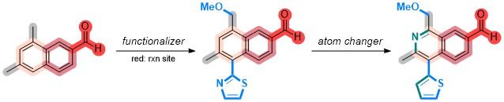
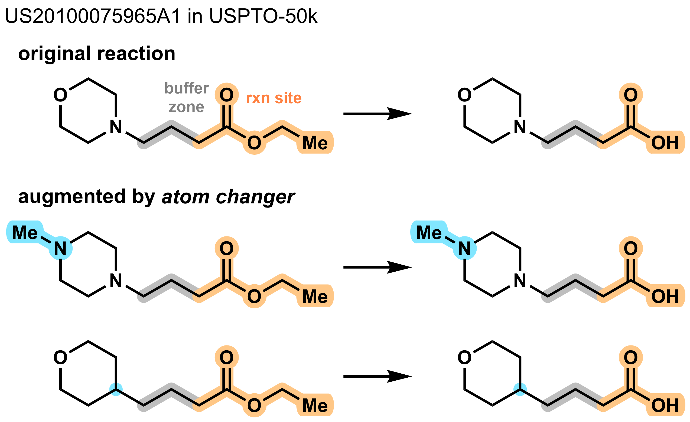
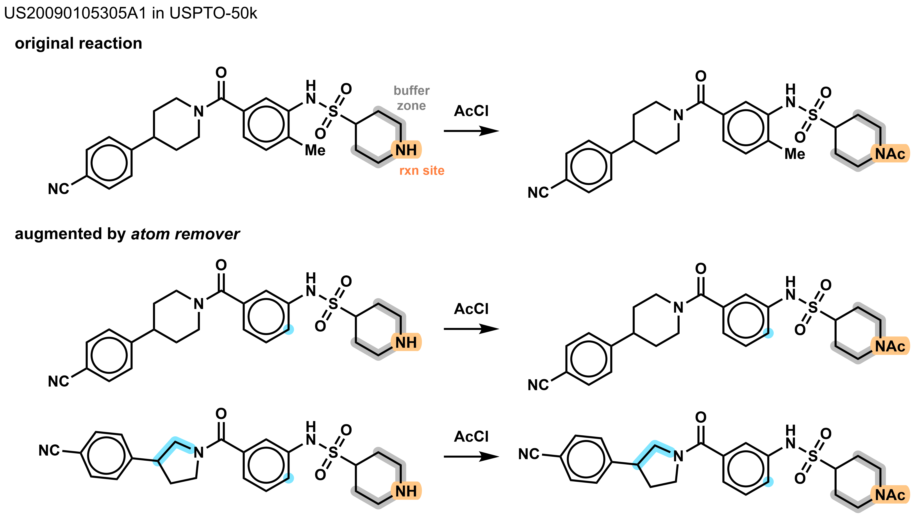
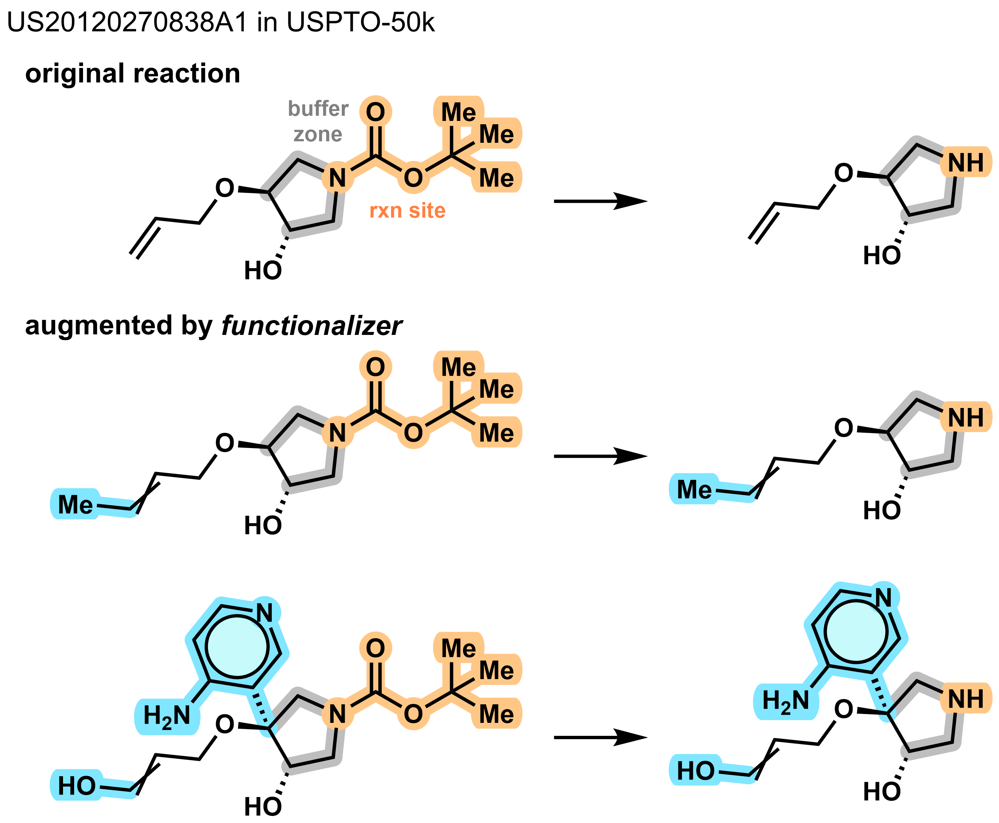
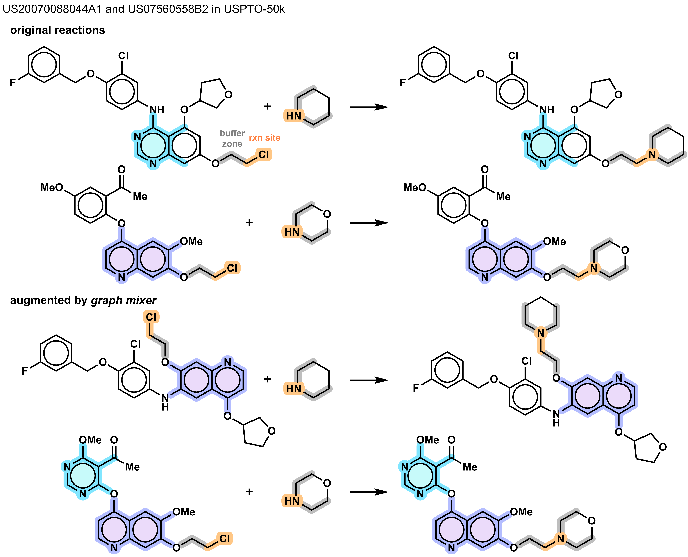
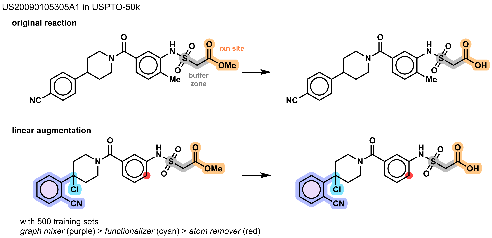

# **Virtual Reaction Generator (VRG)**

<p align="left">
 
</p>

<br>

***

> * **installation** <br>
*VRG was developed in jupyter-lab under anaconda environment.*

```anaconda
conda create –n vrg python==3.12
conda activate vrg
conda install numpy pandas tqdm scikit-learn scipy
conda install -c conda-forge rdkit
conda install -c conda-forge jupyter-lab
jupyter-lab
```

<br>

> * **Module 1.** [`Atom Changer`](#1-atom-changer)
> * **Module 2.** [`Atom Remover`](#2-atom-remover)
> * **Module 3.** [`Functionalizer`](#3-functionalizer)
> * **Module 4.** [`Graph Mixer`](#4-graph-mixer)
> * **Linear Augmentation** [`Linear Model`](#5-linear-model)

<br>

***

<br>

### **1. Atom Changer**

main_atom_changer.ipynb <br>
dataset\[1\]: reaction center # remove it before use

```python
#atom changer (example)
nrows = 50000
similarity_value = 0.85
n_iter=5
```

**output**
<p align="left">
 
</p>

***

<br>

### **2. Atom Remover**

main_atom_remover.ipynb <br>
dataset\[1\]: UNK

```python
#atom remover (example)
nrows = 50000
similarity_value = 0.85
n_iter=15
```

**output**
<p align="left">
 
</p>

***

<br>

### **3. Functionalizer**

main_functionalizer.ipynb <br>
dataset\[1\]: reaction center # remove it before use

```python
#functionalizer (example)
nrows = 50000
aug_num = 3
aug_num_val = 3
similarity_value = 0.8
daring_value = 0.6
```

**output**
<p align="left">
 
</p>

***

<br>

### **4. Graph Mixer**

main_graph_mixer.ipynb <br>
dataset\[1\]: number of subsituents around the changed ring # remove it before use <br>
id: (id1, id2) # Partial ring from id1 was used to replace part of id2.

```python
#graph mixer (example)
nrows = 50000
similarity_value = 0.8
n_iter=10
```

**output**
<p align="left">
 
</p>

***

<br>

### **5. Linear Model**

main_linear.ipynb <br>
*or* <br>
main_linear.py # for Linux

<br>

dataset\[1\]: mixed # remove it before use

### * *example of utilization* <br>
(example) 500 rows from train > module 4 (10 iter) > module 3 (5 iter) > module 2 (5 iter) > 725 rows <br>
<p align="left">
 
</p>

<br>
<br>

### **Benchmark model**

r-smiles: github.com/otori-bird/retrosynthesis <br>
(pretrained with non-augmented datasets) <br>

To facilitate smoother training, the batch size was optimized for our system. <br>

*see r-smiles_modified.zip* <br>

All trained models and results were uploaded at https://drive.google.com/drive/folders/172dqjaaZn5Gm1YJr_R5Xm1TgrLuBQ0SA <br>

<br>

**retrosynthesis prediction (improved from retrained r-smiles)** <br>

*overall reaction type* <br>

|   modules  | top-1 | top-3 | top-5 | top-10 |
|:----------:|:-----:|:-----:|:-----:|:------:|
| r-original   | 56.3  | 78.7  | 84.7  | 89.7   |
| r-AC         | **+0.2**  | +0.2  | –0.1  | +0.1   |
| r-AR         | +0.0  | **+0.7**  | +0.5  | +0.2   |
| r-FN          | –0.1  | +0.0  | **+0.7**  | **+0.5**   |
| r-GM         | –0.4  | +0.2  | +0.5  | +0.0   |
|   |   |   |   |   |
| r-ensemble   | +0.3    | +1.2    | **+0.9**    | +0.7     |
| r-ensemble'   | **+0.6**    | **+1.5**    | +0.7    | **+0.9**     |

<br>

*overall reaction type (MaxFrag)* <br>

|   modules  | top-1 | top-3 | top-5 | top-10 |
|:----------:|:-----:|:-----:|:-----:|:------:|
| r-original   | 60.7  | 82.3  | 87.6  | 91.7   |
| r-AC         | **+0.3**  | +0.2  | +0.2  | +0.3     |
| r-AR         | +0.0  | **+0.5**  | +0.7  | +0.4     |
| r-F          | –0.1  | +0.0  | **+1.0**  | **+0.7**     |
| r-GM         | –0.3  | +0.3  | +0.4  | +0.1     |
|   |   |   |   |   |
| r-ensemble   | +0.4    | +1.2    | **+1.0**    | +0.5     |
| r-ensemble'   | **+0.7**    | **+1.5**    | +0.9    | +0.6     |

<br>

*acyclic* <br>

|   modules  | top-1 | top-3 | top-5 | top-10 |
|:----------:|:-----:|:-----:|:-----:|:------:|
| r-original   | **58.9**  | 81.4  | 87.3  | 91.9   |
| r-AC         | **+0.0**  | +0.0  | –0.3  | +0.0   |
| r-AR         | –0.2  | **+0.3**  | +0.2  | +0.0   |
| r-FN          | –0.1  | –0.1  | **+0.6**  | **+0.5**   |
| r-GM         | –0.5  | +0.1  | +0.3  | +0.1   |
|   |   |   |   |   |
| r-ensemble   | +0.2    | +1.2    | **+0.7**    | **+0.8**     |
| r-ensemble'   | **+0.6**    | **+1.4**    | +0.6    | **+0.8**     |

<br>

*ring-opening* <br>

|   modules  | top-1 | top-3 | top-5 | top-10 |
|:----------:|:-----:|:-----:|:-----:|:------:|
| r-original   | 30.7  | 52.4  | 60.6  | 67.6   |
| r-AC         | +0.8  | +1.5  | +1.7  | +2.4   |
| r-AR         | +1.4  | **+5.9**  | **+4.5**  | **+3.7**   |
| r-FN          | +0.6  | +0.8  | +1.1  | +3.4   |
| r-GM         | **+2.5**  | +2.5  | +1.7  | +0.6   |
|   |   |   |   |   |
| r-ensemble   | +1.1    | +2.2    | +3.1    | +0.3     |
| r-ensemble'   | +1.4    | +3.1    | +1.7    | +1.7     |

<br>

*ring-closing* <br>

|   modules  | top-1 | top-3 | top-5 | top-10 |
|:----------:|:-----:|:-----:|:-----:|:------:|
| r-original   | 35.5  | 54.5  | 59.5  | **71.9**   |
| r-AC         | **+4.2**  | **+0.9**  | +0.0  | –4.1   |
| r-AR         | +1.7  | **+0.9**  | +0.8  | –1.7   |
| r-FN          | –3.3  | **+0.9**  | +1.7  | –4.8   |
| r-GM         | –4.1  | +0.1  | **+3.3**  | –4.8   |
|   |   |   |   |   |
| r-ensemble   | –0.8    | +0.9   | +1.7    | –1.7     |
| r-ensemble'   | –2.4    | **+1.7**   | +1.7    | –0.8     |

<br>

*with chiral reactant* <br>

|   modules  | top-1 | top-3 | top-5 | top-10 |
|:----------:|:-----:|:-----:|:-----:|:------:|
| r-original   | **52.3**  | 73.3  | 79.7  | 85.9   |
| r-AC         | –0.5  | +0.0  | –0.6  | –0.9   |
| r-AR         | –0.9  | **+0.6**  | +0.1  | –0.3   |
| r-FN          | –1.0  | +0.3  | **+0.7**  | **+0.1**   |
| r-GM         | –0.2  | –0.4  | +0.1  | –0.4   |
|   |   |   |   |   |
| r-ensemble   | –0.7    | +1.9    | **+1.2**    | +0.1     |
| r-ensemble'   | **+0.0**    | **+2.6**    | +0.7    | **+0.7**     |

<br>

*w/o chiral reactant* <br>

|   modules  | top-1 | top-3 | top-5 | top-10 |
|:----------:|:-----:|:-----:|:-----:|:------:|
| r-original   | 57.2  | 79.9  | 85.9  | 90.5   |
| r-AC         | **+0.4**  | +0.3  | +0.0  | +0.4   |
| r-AR         | +0.2  | **+0.8**  | **+0.6**  | +0.4   |
| r-FN          | +0.1  | –0.1  | **+0.6**  | **+0.7**   |
| r-GM         | –0.4  | +0.4  | **+0.6**  | +0.2   |
|   |   |   |   |   |
| r-ensemble   | +0.5    | +1.1    | **+0.8**    | +0.9     |
| r-ensemble'   | **+0.6**    | **+1.3**    | +0.7    | **+1.0**     |

